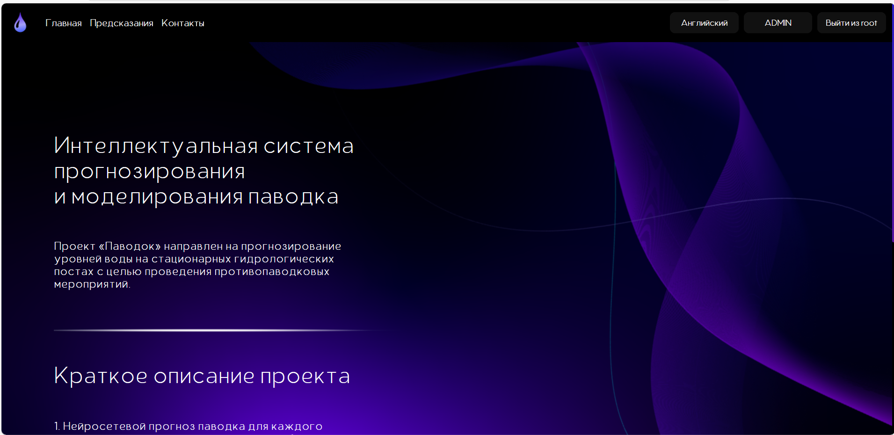
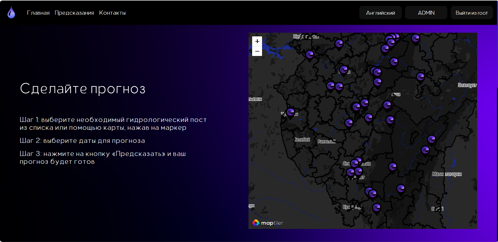
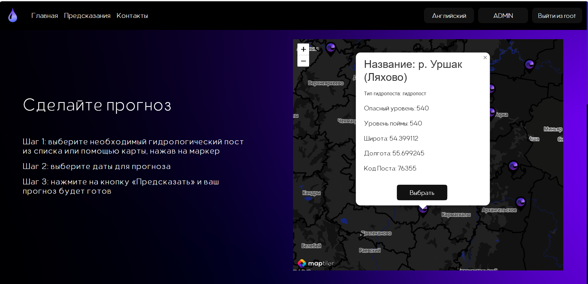
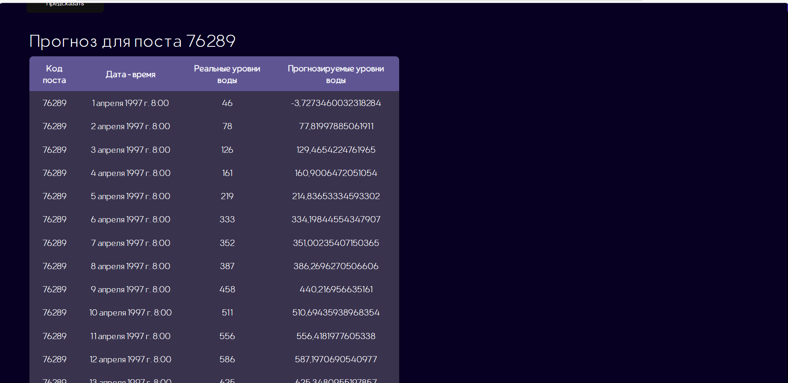
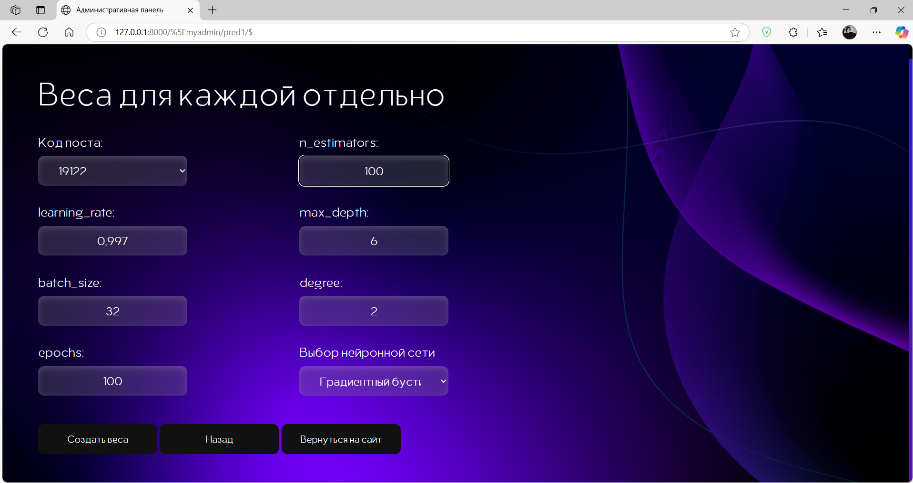

## Обо мне:

**Студент Финансового университета при Правительстве Российской Федерации**
Факультет информационных технологий и анализа больших данных (ИТиАБД).
Специальность: Прикладные информационные системы в экономике и финансах.
Средний балл - 94.5

## Мой стек технологий:
### Hard Skills
#### Data Science & Machine Learning:
Python, Pandas, NumPy, Машинное обучение, PyTorch, TensorFlow, Математическая статистика, Математический анализ, BI-аналитика

#### Работа с данными и базами данных:
SQL, PostgreSQL

#### Инструменты и технологии: 
Git, Docker, Linux, Webpack

#### Frontend-разработка: 
HTML, CSS, Sass, JavaScript, React

### Soft Skills:
Командная работа, критическое мышление, аналитическое мышление, самоорганизация, гибкость и адаптивность, эффективная коммуникация, способность быстро обучаться

## Опыт работы, проекты:

### Учебные проекты 2022-2023
- Разработка моделей для прогнозирования уровня воды (LSTM, Gradient Boosting, SNN, Spiking NN). Анализ влияния прогнозов на промышленные объекты
- Прогнозирование уровня воды в Республике Башкортостан.Использование Gradient Boosting, Polynomial Regression, RNN, SNN.Реализация web-приложения на Django.
  
  
  

### Учебные проекты 2023-2024
- Разработка web-приложения "Чат-GPT" для образовательных целей (сотавление учебных материалов)
- Архитектура чат-бота написана на языке программирования Java, на основе фреймворка Spring Boot
- Графический интерфейс сделан в соответствии с макетами с помощью HTML, CSS и JavaScript
- применение API.Использование модели ИИ open-mistral-7b
- Проект можно посмотреть по ссылке: https://edu.elforecasting.com/

### Учебные проекты 2024-2025
- Реализация лендинга на курсах от Яндекс.Практикума. роект представляет собой лендинг, содержащий в себе новые секции такие, как techniques, video, oakley, khan и resources, и функции такие, как анимация, шрифты, фреймы. [Сайт доступен по ссылке](https://adrenaline22.github.io/project2/)
- Реализация лендинга про Путешествия от Яндекс.Практикума. Одностраничный, адаптивный сайт, который создан с использованием HTML и CSS. Реализован по правилам flexbox, grid, используется CSS анимация, медиазапросы, подключены шрифты. Файловая структура организована по файловой структуре БЭМ.
  [Сайт доступен по ссылке](https://adrenaline22.github.io/https---github.com-Adrenaline22-project3/)

## Пройденные курсы:
- Stepik: Python, SQL, Java
- Яндекс.Практикум: Backend, Frontend (в процессе)
